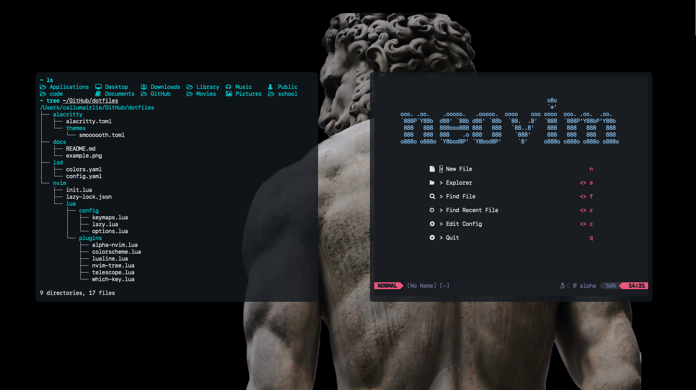

# My dotfiles

### Some Apps I Use
- [Alacritty](https://github.com/alacritty/alacritty) (Rust-based Terminal emulator)
- [Alfred 5](https://www.alfredapp.com/) (Spotlight replacement)
- [AppCleaner](https://freemacsoft.net/appcleaner/)
- [Hidden Bar](https://github.com/dwarvesf/hidden) (Hide MacOS menu bar items)
- [Karabiner Elements](https://karabiner-elements.pqrs.org/) (Remap keyboard)
- [Lightweight PDF](https://lightweightpdf.com/) (Simple pdf compressor)
- [Monitor Control](https://github.com/MonitorControl/MonitorControl) (Control brightness of external monitors)
- [Numi](https://numi.app/) (Calculator with natural language support)
- [Rectangle](https://rectangleapp.com/) (Window manager for MacOS)
- [SelfControl](https://selfcontrolapp.com/) (Nuclear content blocker)
- [Taskell](https://taskell.app) (To-do list with Vim keybindings)
- [HotKey](https://codenuts.de/en/posts/hotkey/) (Custom hotkeys for MacOS)
- [Amethyst](https://github.com/ianyh/Amethyst) (Window focusing w/keybindings)

### Formulae Installed with Homebrew
- [lazygit](https://formulae.brew.sh/formula/lazygit)
- [lsd](https://formulae.brew.sh/formula/lsd)
- [neovim](https://formulae.brew.sh/formula/neovim)
- [tree](https://formulae.brew.sh/formula/tree)
- [zsh-syntax-highlighting](https://formulae.brew.sh/formula/zsh-syntax-highlighting)
- [zoxide](https://github.com/ajeetdsouza/zoxide)
- [alt-tab](https://alt-tab-macos.netlify.app)
  
### neovim
I use a custom neovim config with [lazy.nvim](https://github.com/folke/lazy.nvim) as my plugin manager

