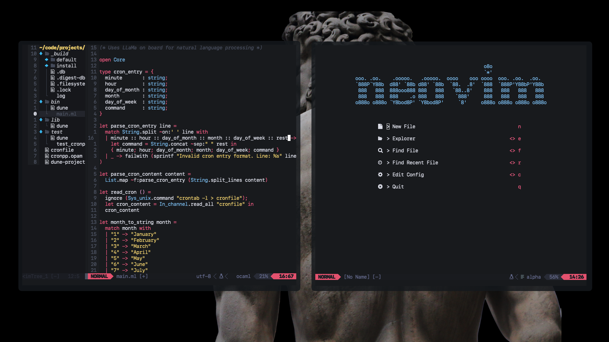

# My dotfiles

### Some Apps I Use
- [Wezterm](https://github.com/wez/wezterm) (Terminal emulator written in Rust with built-in window mulitplexing & lua-based configuration)
- [Alfred 5](https://www.alfredapp.com/) (Spotlight replacement)
- [AppCleaner](https://freemacsoft.net/appcleaner/)
- [Hidden Bar](https://github.com/dwarvesf/hidden) (Hide MacOS menu bar items)
- [Monitor Control](https://github.com/MonitorControl/MonitorControl) (Control brightness of external monitors)
- [Numi](https://numi.app/) (Calculator with natural language support)
- [Rectangle](https://rectangleapp.com/) (Window manager for MacOS)
- [SelfControl](https://selfcontrolapp.com/) (Nuclear content blocker)

### Formulae Installed with Homebrew
- [lazygit](https://formulae.brew.sh/formula/lazygit)
- [lsd](https://formulae.brew.sh/formula/lsd)
- [neovim](https://formulae.brew.sh/formula/neovim)
- [tree](https://formulae.brew.sh/formula/tree)
- [zsh-syntax-highlighting](https://formulae.brew.sh/formula/zsh-syntax-highlighting)
- [zsh-autosuggestions](https://formulae.brew.sh/formula/zsh-autosuggestions)
- [zoxide](https://github.com/ajeetdsouza/zoxide)
  
### neovim
I use a custom neovim config with [lazy.nvim](https://github.com/folke/lazy.nvim) as my plugin manager

